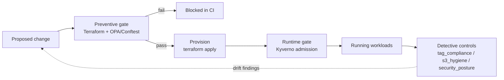

# Automations

A collection of small, self-contained automation scripts for AWS management,
dev workflows, and local machine upkeep. Each tool lives in its own folder with
a dedicated `README.md` and (where needed) a `requirements.txt`.

## Governance model: detect → prevent → enforce at runtime

The repo demonstrates the same controls — **required tags, encryption, no public
exposure** — applied as **defense in depth** across the delivery lifecycle:



| Stage | Where | In this repo |
|-------|-------|--------------|
| **Preventive** | pre-merge (CI) | [`preventative_deploy`](preventative_deploy) — Terraform gated by OPA/Conftest (+ advisory Checkov) |
| **Runtime** | admission control | [`preventative_deploy/runtime`](preventative_deploy/runtime) — kind + Kyverno reject non-compliant workloads |
| **Detective** | continuous audit | the `automations/` scripts that find violations in a live account |

The `automations/` tools are the *detective* layer; `preventative_deploy` shifts
the same standards *left* (block before merge) and *down* (enforce at runtime).

## Conventions

All tools share a few deliberate conventions:

- **Safe by default.** Anything that deletes, releases, or otherwise makes
  destructive/irreversible changes runs in **dry-run / report mode** by default
  and requires an explicit flag (`--delete`, `--run`, `--apply`, `--push`) to
  act. Read-only reporters need no such flag.
- **Minimal dependencies.** AWS tools use `boto3`; everything else is Python
  standard library only.
- **AWS credentials** come from the standard boto3 chain (env vars,
  `~/.aws/credentials`, or an attached role). Each AWS tool's README lists the
  exact IAM permissions it needs.
- **Per-tool setup:** `cd <tool> && python3 -m venv .venv && source .venv/bin/activate && pip install -r requirements.txt`
  (skip the install for stdlib-only tools).

## AWS automations — `automations/`

| Tool | Does | Default mode |
|------|------|--------------|
| [`cost_report`](automations/cost_report) | Daily + month-to-date spend by service (Cost Explorer) → Slack/stdout. | read-only |
| [`resource_cleanup`](automations/resource_cleanup) | Finds unattached EBS volumes, old snapshots, unused EIPs, idle load balancers. | dry-run (`--delete`) |
| [`tag_compliance`](automations/tag_compliance) | Reports resources missing required tags; can auto-fill them. | report (`--apply`) |
| [`s3_hygiene`](automations/s3_hygiene) | Flags buckets that are public, unencrypted, or lack a lifecycle policy. | read-only |
| [`security_posture`](automations/security_posture) | Root/user MFA, old access keys, security groups open to the world. | read-only |
| [`snapshot_and_pruning`](automations/snapshot_and_pruning) | Creates EBS/RDS snapshots for tagged resources; prunes its own old ones. | dry-run (`--run`) |

## Dev workflow automations — `dev-workflow-automations/`

| Tool | Does | Notes |
|------|------|-------|
| [`environment_bootstrap`](dev-workflow-automations/environment_bootstrap) | Scaffolds a new Python project: structure, venv, linting, git hook, env files. | stdlib only |
| [`precommit_checks`](dev-workflow-automations/precommit_checks) | Format, lint, and test staged files before each commit. | self-installs as a git hook |
| [`release_helper`](dev-workflow-automations/release_helper) | Bump version, generate changelog, commit, tag, push. | local by default (`--push`) |

## Local machine automations — `local_automations/`

| Tool | Does | Default mode |
|------|------|--------------|
| [`s3_backup`](local_automations/s3_backup) | Incremental backup of folders to a versioned S3 bucket. | uploads (`--dry-run` to preview) |
| [`log_rotation`](local_automations/log_rotation) | Compresses old logs and deletes very old ones. | dry-run (`--run`) |
| [`scheduled_health_checks`](local_automations/scheduled_health_checks) | Disk + service checks with Slack/desktop alerts; non-zero exit on failure. | read-only |

## Quick start

```bash
# Example: a safe, read-only AWS cost report
cd automations/cost_report
python3 -m venv .venv && source .venv/bin/activate
pip install -r requirements.txt
python3 cost_report.py

# Example: preview a destructive tool before acting (dry-run)
cd ../resource_cleanup && pip install -r requirements.txt
python3 resource_cleanup.py            # report only
python3 resource_cleanup.py --delete   # actually remove (after review)
```

## Testing & CI

Every Python tool has unit tests, and CI runs on every push/PR. The tools
target **Python 3.11+**.

```bash
python3 -m venv .venv && source .venv/bin/activate
pip install -r requirements-dev.txt
ruff format --check .   # formatting
ruff check .            # lint
pytest -q               # tests (stdlib + moto-mocked AWS)
```

- **Tests** live next to the tools they cover (`test_*.py`). Pure/stdlib logic
  (e.g. `log_rotation`, `cost_report`, `release_helper`, `health_checks`) is
  tested directly; anything touching AWS (`s3_hygiene`, `resource_cleanup`,
  `security_posture`, `snapshot_and_pruning`, `s3_backup`) is mocked with
  [moto](https://github.com/getmoto/moto) — no real account or credentials.
- **`.github/workflows/python-ci.yml`** — runs `ruff format --check`, `ruff
  check`, and `pytest` across Python 3.11 and 3.13.
- **`.github/workflows/policy-gate.yml`** — runs the `preventative_deploy`
  policy gate: OPA/Conftest (blocking org policy) plus an advisory Checkov
  baseline scan.

## Notes

- Several tools post to Slack via an incoming webhook in the `SLACK_WEBHOOK_URL`
  environment variable; if it's unset they print to stdout instead.
- Scheduling: each tool's README includes a cron example. Read-only reporters
  are safe to schedule directly; for destructive tools, schedule a dry-run/report
  and review before automating the acting flag.
- See each tool's `README.md` for full options, IAM permissions, examples, and
  caveats.
